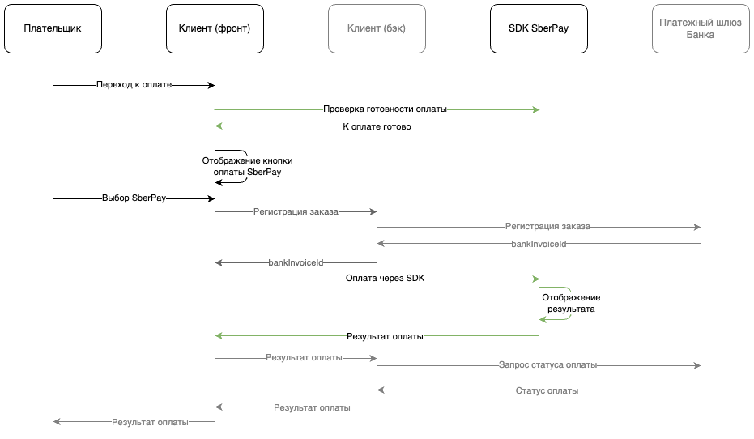

# [SberPaySdkIOSDoc](https://sdkpay.github.io/SberPaySdkIOSDoc/)

#### [Бординг](https://sdkpay.github.io/SberPaySdkIOSDoc/boarding) | [Регистрация заказов в платежном шлюзе Сбера](https://sdkpay.github.io/SberPaySdkIOSDoc/order_registration) | [Начало работы](https://sdkpay.github.io/SberPaySdkIOSDoc/start) | [Сценарии оплаты через SDK](https://sdkpay.github.io/SberPaySdkIOSDoc/payment_script) | [Работа в режиме посочницы](https://sdkpay.github.io/SberPaySdkIOSDoc/sandbox_mode) | [Вспомогательные структуры данных](https://sdkpay.github.io/SberPaySdkIOSDoc/data_structures) | [Актуальная версия SDK](https://sdkpay.github.io/SberPaySdkIOSDoc/version) | [Поддержка](https://sdkpay.github.io/SberPaySdkIOSDoc/support) | [FAQ](https://sdkpay.github.io/SberPaySdkIOSDoc/faq)

<br>

# Сценарии оплаты

#### [Автоматическая оплата](https://sdkpay.github.io/SberPaySdkIOSDoc/payment_script#автоматическая-оплата-1)
#### [Оплата без рефреш-токена](https://sdkpay.github.io/SberPaySdkIOSDoc/payment_script#оплата-без-рефреш-токена-1)
#### [Оплата частями с комиссией](https://sdkpay.github.io/SberPaySdkIOSDoc/payment_script#оплата-частями-с-комиссией-1)
#### [Оплата со списанием бонусов «Спасибо»](https://sdkpay.github.io/SberPaySdkIOSDoc/payment_script#оплата-со-списанием-бонусов-спасибо-1)

<br>

## Автоматическая оплата

Если оплата происходит через экваринг Сбербанка и известен BankInvoiceId (Значение sbolBankInvoiceId ), тогда следует воспользоваться автоматической оплатой

<br>

### Схема взаимодействия



### Сценарий автоматической оплаты

Для автоматической оплаты необходимо воспользоваться методом `payWithBankInvoiceId`. Ниже представлен список параметров метода

|Объект|Тип|Формат|Обязательный|Описание|
|---|:---:|:---:|:---:|---|
|apiKey|String|ANS..512	|Да|Ключ клиента для работы с сервисами платежного шлюза через SDK|
|merchantLogin|String|ANS..512|Да|*Login* партнера для работы с сервисами платежного шлюза|
|language|String|A2|Нет|Уникальный номер (идентификатор) заказа в Платежном шлюзе Банка. Необходимо передавать значение `sbolBankInvoiceId` (передается в `externalParams`)|
|bankInvoiceId|String|ANS..36|Да|Уникальный номер (идентификатор) заказа в Платежном шлюзе Банка. Необходимо передавать значение `sbolBankInvoiceId` (передается в `externalParams`)|
|redirectUri|String|ANS..512|Да|Диплинк, переданный вам вместе c приветственным письмом. Пример: *apptest://spay*|
|orderNumber|String|ANS..36|Да|Уникальный номер (идентификатор) заказа в системе Клиента|

Пример инициализации структуры для запроса:

### Swift

```
let request = SBankInvoicePaymentRequest(
    merchantLogin: "Test shop",
    bankInvoiceId: bankInvoiceId,
    orderNumber: "123add",
    redirectUri: "sberPayExampleapp://spay"
    )
```

### Objective-C

```
SBankInvoicePaymentRequest *request[[SBankInvoicePaymentRequest alloc] initWithMerchantLogin: @"Test shop"
orderId:@"12312312"
orderNumber:@"123add"
language:nil
redirectUri:@"sberPayExampleapp://spay"];
```

### Вызов метода payWithBankInvoiceId

После инициализации структуры запроса необходимо вызвать сам метод `payWithBankInvoiceId`, передать в его параметры созданную ранее структуру и текущий `UIViewController` вашего приложения.

### Swift

```
SPay.payWithBankInvoiceId(with: self, with: request) { state, info, localSessionId in

    switch state {
        case .success: print("Успешный результат")
        case .waiting: print("Необходимо проверить статус оплаты")
        case .cancel: print("Пользователь отменил оплату")
        case .error: print("(info) - описание ошибки")
        @unknown default: print("Неопределенная ошибка")
    }
}
```

### Objective-C

```
[SPay payWithBankInvoiceIdWith:self with:request completion:^(enum SPayState state, NSString * _Nonnull info, NSString * _Nonnull localSessionId) {

switch(state) {
    case SPayStateSuccess: NSLog(@"Успешный результат");
    break;
    case SPayStateWaiting: NSLog(@"Необходимо проверить статус оплаты");
    break;
    case SPayStateCancel: NSLog(@"Пользователь отменил оплату");
    break;
    case SPayStateError: NSLog(@"%@ - описание ошибки", info);  
    break;
}
}];
```

<br>

## Оплата без рефреш-токена

### Сценарий оплаты без рефреш-токена

В этом режиме авторизация через банк потребуется каждую оплату. Для автоматической оплаты необходимо воспользоваться методом `payWithoutRefresh`. Ниже представлен список параметров метода

|Объект|Тип|Формат|Обязательный|Описание|
|---|:---:|:---:|:---:|---|
|apiKey|String|ANS..512	|Да|Ключ клиента для работы с сервисами платежного шлюза через SDK|
|merchantLogin|String|ANS..512|Да|*Login* партнера для работы с сервисами платежного шлюза|
|language|String|A2|Нет|Уникальный номер (идентификатор) заказа в Платежном шлюзе Банка. Необходимо передавать значение `sbolBankInvoiceId` (передается в `externalParams`)|
|bankInvoiceId|String|ANS..36|Да|Уникальный номер (идентификатор) заказа в Платежном шлюзе Банка. Необходимо передавать значение `sbolBankInvoiceId` (передается в `externalParams`)|
|redirectUri|String|ANS..512|Да|Диплинк, переданный вам вместе c приветственным письмом. Пример: *apptest://spay*|
|orderNumber|String|ANS..36|Да|Уникальный номер (идентификатор) заказа в системе Клиента|

Пример инициализации структуры для запроса:

### Swift

```
let request = SBankInvoicePaymentRequest(
    merchantLogin: "Test shop",
    bankInvoiceId: bankInvoiceId,
    orderNumber: "123add",
    redirectUri: "sberPayExampleapp://spay"
    )
```

### Objective-C

```
SBankInvoicePaymentRequest *request = [[SBankInvoicePaymentRequest alloc] initWithMerchantLogin: @"Test shop"
orderId:@"12312312"
orderNumber:@"123add"
language:nil
redirectUri:@"sberPayExampleapp://spay"];
```

### Вызов метода payWithoutRefresh

После инициализации структуры запроса необходимо вызвать сам метод `payWithoutRefresh`, передать в его параметры созданную ранее структуру и текущий `UIViewController` вашего приложения

### Swift

```
SPay.payWithBankInvoiceId(with: self, with: request) { state, info, localSessionId in

    switch state {
        case .success: print("Успешный результат")
        case .waiting: print("Необходимо проверить статус оплаты")
        case .cancel: print("Пользователь отменил оплату")
        case .error: print("(info) - описание ошибки")
        @unknown default: print("Неопределенная ошибка")
    }
}
```

### Objective-C

```
[SPay payWithBankInvoiceIdWith:self with:request completion:^(enum SPayState state, NSString * _Nonnull info, NSString * _Nonnull localSessionId) {

switch(state) {
    case SPayStateSuccess: NSLog(@"Успешный результат");
    break;
    case SPayStateWaiting: NSLog(@"Необходимо проверить статус оплаты");
    break;
    case SPayStateCancel: NSLog(@"Пользователь отменил оплату");
    break;
    case SPayStateError: NSLog(@"%@ - описание ошибки", info);  
    break;
}
}];
```

<br>

## Оплата частями с комиссией

### Сценарий оплаты частями с комиссией

В этом режиме в SDK можно будет оплатить только частями. Для выбора сценария оплаты только частями с комиссией необходимо использовать метод SDK `payWithPartPay`. Ниже представлен список параметров метода

|Объект|Тип|Формат|Обязательный|Описание|
|---|:---:|:---:|:---:|---|
|apiKey|String|ANS..512	|Да|Ключ клиента для работы с сервисами платежного шлюза через SDK|
|merchantLogin|String|ANS..512|Да|*Login* партнера для работы с сервисами платежного шлюза|
|language|String|A2|Нет|Уникальный номер (идентификатор) заказа в Платежном шлюзе Банка. Необходимо передавать значение `sbolBankInvoiceId` (передается в `externalParams`)|
|bankInvoiceId|String|ANS..36|Да|Уникальный номер (идентификатор) заказа в Платежном шлюзе Банка. Необходимо передавать значение `sbolBankInvoiceId` (передается в `externalParams`)|
|redirectUri|String|ANS..512|Да|Диплинк, переданный вам вместе c приветственным письмом. Пример: *apptest://spay*|
|orderNumber|String|ANS..36|Да|Уникальный номер (идентификатор) заказа в системе Клиента|

Пример инициализации структуры для запроса:

### Swift

```
let request = SBankInvoicePaymentRequest(
    merchantLogin: "Test shop",
    bankInvoiceId: bankInvoiceId,
    orderNumber: "123add",
    redirectUri: "sberPayExampleapp://spay"
    )
```

### Objective-C

```
SBankInvoicePaymentRequest *request = [[SBankInvoicePaymentRequest alloc] initWithMerchantLogin: @"Test shop"
orderId:@"12312312"
orderNumber:@"123add"
language:nil
redirectUri:@"sberPayExampleapp://spay"];
```

### Вызов метода payWithPartPay

После инициализации структуры запроса необходимо вызвать сам метод `payWithPartPay`, передать в его параметры созданную ранее структуру и текущий `UIViewController` вашего приложения

### Swift

```
SPay.payWithBankInvoiceId(with: self, with: request) { state, info, localSessionId in

    switch state {
        case .success: print("Успешный результат")
        case .waiting: print("Необходимо проверить статус оплаты")
        case .cancel: print("Пользователь отменил оплату")
        case .error: print("(info) - описание ошибки")
        @unknown default: print("Неопределенная ошибка")
    }
}
```

### Objective-C

```
[SPay payWithBankInvoiceIdWith:self with:request completion:^(enum SPayState state, NSString * _Nonnull info, NSString * _Nonnull localSessionId) {

switch(state) {
    case SPayStateSuccess: NSLog(@"Успешный результат");
    break;
    case SPayStateWaiting: NSLog(@"Необходимо проверить статус оплаты");
    break;
    case SPayStateCancel: NSLog(@"Пользователь отменил оплату");
    break;
    case SPayStateError: NSLog(@"%@ - описание ошибки", info);  
    break;
}
}];
```

## Оплата со списанием бонусов «Спасибо»

### Сценарий оплаты со списанием бонусов «Спасибо»

Для выбора сценария оплаты с бонусами «Спасибо» необходимо использовать метод SDK `payWithBonuses`. Ниже представлен список параметров метода

|Объект|Тип|Формат|Обязательный|Описание|
|---|:---:|:---:|:---:|---|
|apiKey|String|ANS..512	|Да|Ключ клиента для работы с сервисами платежного шлюза через SDK|
|merchantLogin|String|ANS..512|Да|*Login* партнера для работы с сервисами платежного шлюза|
|language|String|A2|Нет|Уникальный номер (идентификатор) заказа в Платежном шлюзе Банка. Необходимо передавать значение `sbolBankInvoiceId` (передается в `externalParams`)|
|bankInvoiceId|String|ANS..36|Да|Уникальный номер (идентификатор) заказа в Платежном шлюзе Банка. Необходимо передавать значение `sbolBankInvoiceId` (передается в `externalParams`)|
|redirectUri|String|ANS..512|Да|Диплинк, переданный вам вместе c приветственным письмом. Пример: *apptest://spay*|
|orderNumber|String|ANS..36|Да|Уникальный номер (идентификатор) заказа в системе Клиента|

Пример инициализации структуры для запроса:

### Swift

```
let request = SBankInvoicePaymentRequest(
    merchantLogin: "Test shop",
    bankInvoiceId: bankInvoiceId,
    orderNumber: "123add",
    redirectUri: "sberPayExampleapp://spay"
    )
```

### Objective-C

```
SBankInvoicePaymentRequest *request = [[SBankInvoicePaymentRequest alloc] initWithMerchantLogin: @"Test shop"
orderId:@"12312312"
orderNumber:@"123add"
language:nil
redirectUri:@"sberPayExampleapp://spay"];
```

### Вызов метода payWithBonuses

После инициализации структуры запроса необходимо вызвать сам метод `payWithBonuses`, передать в его параметры созданную ранее структуру и текущий `UIViewController` вашего приложения.

### Swift

```
SPay.payWithBankInvoiceId(with: self, with: request) { state, info, localSessionId in

    switch state {
        case .success: print("Успешный результат")
        case .waiting: print("Необходимо проверить статус оплаты")
        case .cancel: print("Пользователь отменил оплату")
        case .error: print("(info) - описание ошибки")
        @unknown default: print("Неопределенная ошибка")
    }
}
```

### Objective-C

```
[SPay payWithBankInvoiceIdWith:self with:request completion:^(enum SPayState state, NSString * _Nonnull info, NSString * _Nonnull localSessionId) {

switch(state) {
    case SPayStateSuccess: NSLog(@"Успешный результат");
    break;
    case SPayStateWaiting: NSLog(@"Необходимо проверить статус оплаты");
    break;
    case SPayStateCancel: NSLog(@"Пользователь отменил оплату");
    break;
    case SPayStateError: NSLog(@"%@ - описание ошибки", info);  
    break;
}
}];
```


